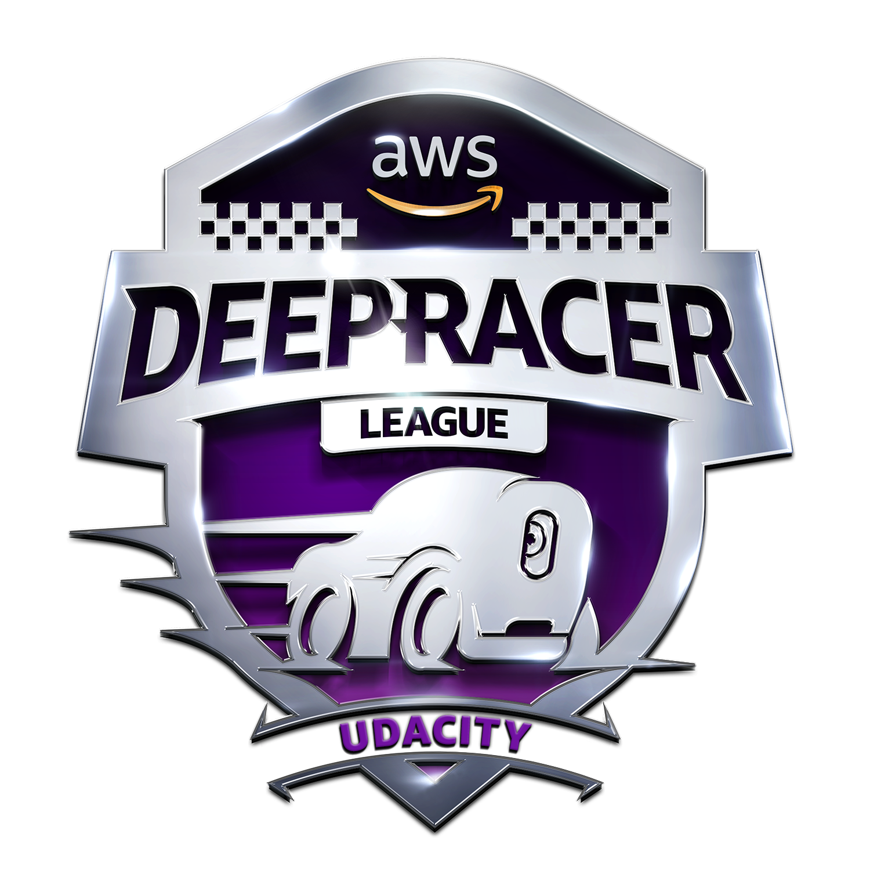

# AWS DeepRacer Scholarship Challenge 2019 Notes

  

A collection of notes on AWS DeepRacer Scholarship Challenge 2019.

Contributions are always welcome!

<!-- toc -->

## Lesson 1: Welcome! Important Details on the AWS DeepRacer Scholarship

### 1. AWS DeepRacer Scholarship Challenge

## Lesson 2: Get Started with AWS DeepRacer

### 1. Intro to AWS DeepRacer
### 2. Welcome

* the car's tech specs, assembly and calibration
* the basics of reinforcement learning and its use in AWS DeepRacer
* building, training and deploying your racing model using AWS in both simulated and real-world tracks
* how to compete in the DeepRacer League

### 3. RL in AWS DeepRacer
* AWS DeepRacer:
    * is fully-autonomous
    * is a 1/18th scale racing car
    * utilizes RL to learn driving habits
* Types of machine learning include:
    * Supervised learning
    * Unsupervised learning
    * Reinforcement learning

### 4. Unboxing AWS DeepRacer
* Unboxing Recap
    *   AWS DeepRacer includes the following in its box:

        1. Car chassis (with compute and camera modules)
        2. Car body
        3. Car battery
        4. Car battery charger
        5. Car battery power adapter
        6. Compute module power bank
        7. Power bank’s connector cable
        8. Power adapter and power cord for compute module and power bank
        9. 4 pins (car chassis pins)
        10. 12 pins (spare parts)
        11. USB-A to micro USB cable

    * You can read more in the [Getting Started Guide](https://d1.awsstatic.com/deepracer/AWS-DeepRacer-Getting-Started-Guide.pdf).

### 5. Under the Hood

* Other than the vehicle chassis, the vehicle also includes:

    * a HD DeepLens camera
    * expansion ports
    * HDMI port
    * microUSB port
    * USB-C port
    * on/off switch
    * reset button
    * LEDs

### 6. DeepRacer Assembly

### 7. Steering Calibration

1. Place your car on a block (secure it with duct tape or similar) to keep it in place while the wheels move.
2. Get your vehicle’s IP address from when it was set up to use wi-fi.
3. Sign in to the AWS DeepRacer console with that IP address as instructed here.
4. Select Calibration, then Calibrate Steering Angle from the console (see here).
5. Calibrate your center steering first. Remember: Due to the concepts of Ackermann steering, only one wheel will actually be straight when you calibrate center steering.
6. Calibrate your left steering by choosing the value where your vehicle wheels will turn no further left.
7. Calibrate your right steering by choosing the value where your vehicle wheels will turn no further right.

### 8. Throttle Calibration

1. Place your car on a block (secure it with duct tape or similar) to keep it in place while the wheels move.
2. Get your vehicle’s IP address from when it was set up to use wi-fi.
3. Sign in to the AWS DeepRacer console with that IP address as instructed here.
4. Select Calibration, then Calibrate Speed from the console (see here).
5. Calibrate your stopped speed by moving the bar until the wheels are no longer moving.
6. Calibrate the forward motion by moving the bar and checking the direction the wheels turn. If they turn clockwise, the forward direction is set. If not, select the “Reverse direction” button to switch the direction the wheels turn to go forward.
7. Calibrate the forward maximum speed. Typically, it’s best not to go too high above 2 m/s, as that is the highest the simulator provides in its action space.
8. Calibrate the maximum backward speed, which should be essentially the negative value of what the maximum forward speed was set at.

### 9. Track Preview

## Lesson 3: Test Drive DeepRacer

### 1. Lesson Overview
### 2. Around the Track
### 3. AWS DeepRacer workflow
### 4. The Console and Your First Model

1. Sign into the console
2. Click the Get Started / Create Model button on the right
3. Create resources, if they aren't created yet
4. Name and describe your model
5. Choose an environment (re:Invent 2018 for now)
6. Select action space
7. Select reward function
8. Tune hyperparameters
9. Set stop condition

### 5. The Basic Reward Function

* decreasing rewards based on the vehicle being within a given marker or not

### 6. Exercise I: Training on the Console

1. Akses dan navigasikan konsol AWS DeepRacer
2. Identifikasi langkah-langkah yang digunakan untuk membangun model di konsol AWS DeepRacer
3. Gunakan fungsi hadiah dasar di AWS DeepRacer saat mengkonfigurasi model
4. Gunakan simulator AWS DeepRacer untuk melatih dan mengevaluasi suatu model

### 7. Exercise I: Task I

### 8. Exercise I: Conclusion

1. Accessed and navigated within the AWS DeepRacer console
2. Identified the steps that go into building a model in the AWS DeepRacer console
3. Used the basic reward function in AWS DeepRacer to configure a model
4. Used the AWS DeepRacer simulator to train and evaluate a model

## Lesson 4: Reinforcement Learning
## Lesson 5: Tuning Your Model
## Lesson 6: DeepRacer in the Real World
## Lesson 7: The League